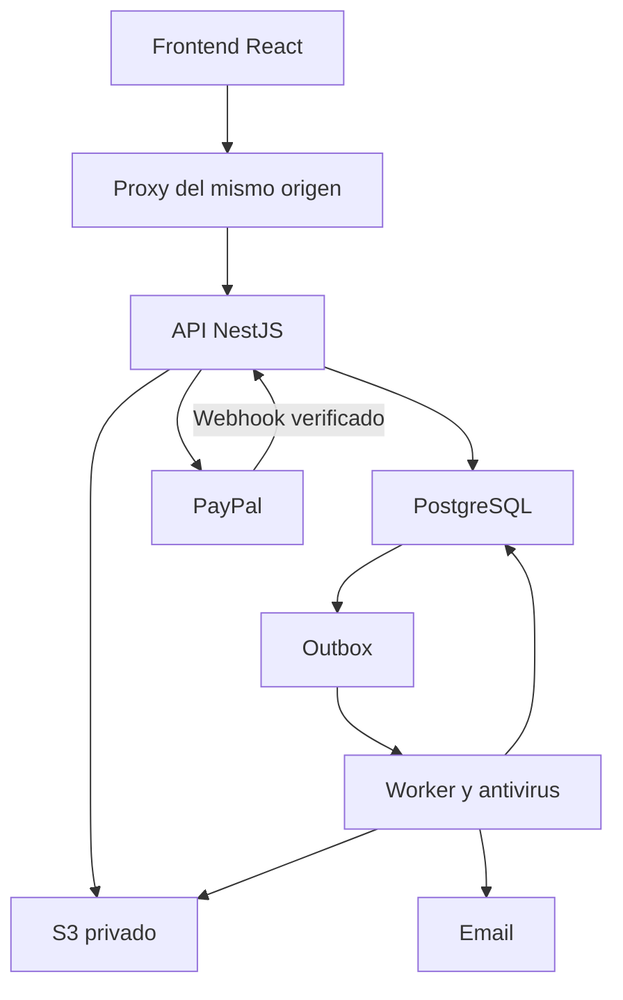

# Arquitectura revisada

Frontend React/Next-compatible → proxy del mismo origen → API NestJS → PostgreSQL. Redis/BullMQ ejecuta tareas a partir de una outbox transaccional. PayPal entrega webhooks a la API externa. S3 almacena archivos privados; solo la API genera descargas vinculadas a sesión. El servidor antivirus trabaja en disco temporal aislado y nunca ejecuta proyectos subidos.

El backend es un monolito modular. Finanzas, acceso y retenciones se modifican en transacciones PostgreSQL; ninguna confirmación del navegador acredita una venta. El frontend en Sites no almacena contraseñas, documentos, saldos ni pagos en localStorage.

Cambios aprobados: cobros iniciales USD por PayPal; eliminación con purga de contenido, sin conservación de versiones compradas; aviso y aceptación antes de adquirir; descarga administrativa sin notificación ni estadísticas del vendedor. El registro financiero y la licencia aceptada permanecen, separados de los archivos eliminados.

La migración SQL es el esquema concreto: usuarios/sesiones/TOTP; vendedores; categorías/proyectos/versiones/archivos; órdenes/capturas/eventos/accesos; cuentas/asientos/movimientos/saldos/retenciones; identidad/cuentas/retiros; comentarios/valoraciones/reportes; campañas/cupones/contenidos; configuración/legal/auditoría/backups. UUID para entidades, bigint para centavos, timestamptz para fechas.

Política de garantía: el comprador debe guardar su copia; un aviso no elimina derechos legales. La cuenta CREADOR puede acceder a contenido alojado para las finalidades declaradas, pero no a archivos ya purgados. Los enlaces firmados requieren sesión y permiso actuales.
